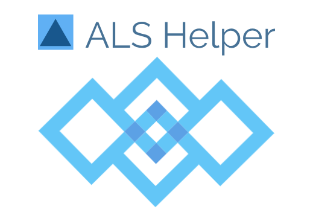

# ALS Helper
A virtual assistant that helps you remember people that you know and things you have to do by providing non-invasive cues through an intelligent voice interface.

# How I built it
I used an *Angular app* for the front end UI and a *Flask app* for the backend. I used facial recognition from the *Microsoft Azure Face API*. From Google, I utilized *Google Compute Engine, Google App Engine, Firebase Realtime Database, Google Cloud Storage, and Google Cloud Text-to-Speech*.

*Note*

Right now the database is not populated well, but it is fairly easy to populate the database with more people if you go into the backend loadDatabase.py file and edit accordingly.

*Copyright 2019 Pranav Eranki*
